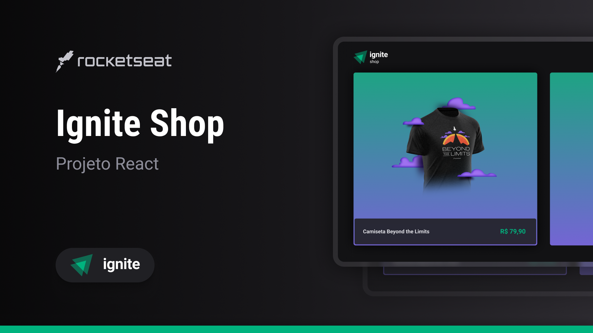

<h1 align="center">
  Ignite Shop 👕
</h1>

<p align="center">
  

  
  
  <a href="https://github.com/RuanCxrdoso/Projeto-Robo/commits/main">
    
  </a>

  

  <a href="https://github.com/RuanCxrdoso/Ignite-shop/stargazers">
    
  </a>
</p>


<p align="center">
  
</p>

<h4 align="center"> 
	✅ Projeto finalizado ✅
</h4>

<p align="center">
 <a href="#-sobre">Sobre</a> |
 <a href="#-deploy">Deploy</a> |
 <a href="#-como-utilizar">Como utilizar</a> | 
 <a href="#-layout">Layout</a> | 
 <a href="#-tecnologias">Tecnologias</a> | 
 <a href="#-autor">Autor</a> | 
 <a href="#-licença">Licença</a>
</p>


## 💻 Sobre

O **Ignite Shop** é um projeto desenvolvido na trilha **Ignite** de React da [Rocketseat](https://www.rocketseat.com.br/). Esta aplicação de comércio eletrônico permite aos usuários explorar e comprar uma variedade de camisetas. Utilizando `Next.js` como base, o projeto oferece uma integração completa com a API do `Stripe` para gerenciamento de produtos e facilitação do checkout. Além disso, faz uso do `Server-Side Rendering` (SSR) para renderizar as páginas com dados do lado do servidor, garantindo um carregamento inicial rápido e uma melhor experiência de SEO. Também utiliza `Static Site Generation` (SSG) para gerar páginas estáticas, proporcionando uma navegação ágil e eficiente. Desenvolvido com foco no aprendizado e na prática dos fundamentos do Next.js, o projeto **Ignite Shop** oferece uma oportunidade para aprofundar conhecimentos em desenvolvimento web.

obs: Para testar o checkout insira os números do cartão fictício disponibilizado pelo Stripe: 4242 4242 4242 4242

---

## 🔗 Deploy

O deploy da aplicação pode ser acessada através da seguinte URL: https://rcardoso-ignite-shop.vercel.app

---

## 🚀 Como utilizar

### Pré-requisitos

Antes de realizar o download do projeto, é necessário instalar na sua máquina as seguintes ferramentas:

* [Git](https://git-scm.com)
* [NodeJS](https://nodejs.org/en/)
* [NPM](https://www.npmjs.com/)

Além disto é importante uma IDE para manipular o código, como o [VSCode](https://code.visualstudio.com/)

### Clonando e Executando

Passo a passo para clonar e executar a aplicação na sua máquina:

```bash
# Clone este repositório
$ git clone git@github.com:RuanCxrdoso/Ignite-shop.git

# Acesse a pasta do projeto no terminal
$ cd Ignite-shop

# Instale as dependências
$ npm install

# Execute a aplicação em modo de desenvolvimento
$ npm run dev

# A aplicação inciará em alguma porta disponível que poderá ser acessada pelo navegador
```

---

## 🎨 Layout

Você pode visualizar o layout do projeto no [figma](https://www.figma.com/file/OIJJEW24DFiJO6XLqHw2DM/Ignite-Shop/duplicate). É necessário ter conta no [Figma](https://www.figma.com/) para acessá-lo.

Veja uma demonstração das principais interfaces da aplicação:

### 📸 Preview


<p align="center">
  
</p>

---

## 🛠 Tecnologias

As seguintes bibliotecas foram utilizadas no desenvolvimento do projeto:

- **[TypeScript](https://www.typescriptlang.org/)**
- **[Next.js](https://nextjs.org/)**
- **[Axios](https://axios-http.com/ptbr/)**
- **[Stitches](https://stitches.dev/)**
- **[Keen-Slider](https://keen-slider.io/)**
- **[Stripe](https://stripe.com/br)**


> Para mais detalhes das libs aplicadas no projeto cheque o arquivo [package.json](./package.json)

---

## ✍ Autor


[](https://www.linkedin.com/in/ruancardosolinkdin/)

[](mailto:cardosoruan2001@gmail.com)

---

## 📝 Licença

Este projeto está sob a licença MIT. Consulte o arquivo [LICENSE](./LICENSE) para mais informações

Feito com 💛 por Ruan 👋🏽 [Entre em contato!](https://www.linkedin.com/in/ruancardosolinkdin/)
